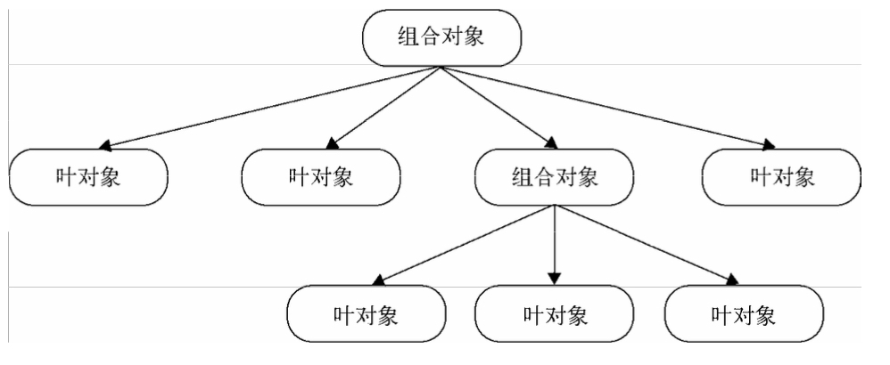

## 定义
组合模式就是用小的子对象来构建更大的对象，而这些小的子对象本身也许是由更小的"孙对象"构成的
## 宏命令-万能遥控器
````js
let closeDoorCommand = {
    execute:function(){
        console.log('关门')
    }
}
let openPcCommand = {
    execute:function(){
        console.log('开电脑')
    }
}
let openQQCommand = {
    execute:function(){
        console.log('登录QQ')
    }
}
let MacroCommand = function(){
    return {
        commandsList:[],
        add: function(command){
            this.commandsList.push(command);
        },
        execute:function(){
            for(let i=0,len=this.commandsList.length;i<len;i++){
                this.commandsList[i].execute()
            }
        }
    }
}

let macroCommand = new MacroCommand()
macroCommand.add(closeDoorCommand)
macroCommand.add(openPcCommand)
macroCommand.add(openQQCommand)
macroCommand.execute()
````
macroCommand就被称为组合对象，它包含多个子对象，macroCommand.execute方法，并不执行真正的操作，而是遍历子对象，把真正的execute请求委托给它们
## 用途
* 将对象组合成树形结构，以表示"部分-整体"的层次结构，像宏命令的这个例子，**提供了一种遍历树形结构的方案**, 通过调用组合对象的execute方法，程序会递归调用子对象的execute方法，像万能遥控器只需要一次操作，便能依次完成关门、打开电脑、登录QQ这几件事
* 利用对象多态性统一对待组合对象和单个对象，忽略它们的不同，像在万能遥控器里面添加一个命令，并不关心这个命令是宏命令还是普通子命令，**只要知道他是一个命令就够了，并且这个命令拥有可执行的execute方法**
## 宏命令改进
从根节点从上到下传递，子节点是叶对象，自身就处理这个请求，如果子节点还是组合对象，请求会继续往下传递


### 万能遥控器plus
* 打开空调
* 打开电视和音响
* 关门、开电脑、登录QQ
````js
let MacroCommand = function(){
    return {
        commandsList:[],
        add: function(command){
            this.commandsList.push(command);
        },
        execute:function(){
            for(let i=0,len=this.commandsList.length;i<len;i++){
                this.commandsList[i].execute()
            }
        }
    }
}

let openAcCommand = {
    execute: function(){
        console.log('打开空调')
    }
}

// 电视和音响是连接在一起的，可以用一个宏命令组合
let openTvCommand = {
    execute: function(){
        console.log('打开电视')
    }
}
let openSoundCommand = {
    execute: function(){
        console.log('打开音响')
    }
}
let macroCommand1 = new MacroCommand()
macroCommand1.add(openTvCommand)
macroCommand1.add(openSoundCommand)

// 关门、打开电脑和登录QQ的命令
let closeDoorCommand = {
    execute: function(){
        console.log('关门')
    }
}
let openPcCommand = {
    execute: function(){
        console.log('开电脑')
    }
}
let openQQCommand = {
    execute: function(){
        console.log('登录QQ')
    }
}
let macroCommand2 = new MacroCommand()
macroCommand2.add(closeDoorCommand)
macroCommand2.add(openPcCommand)
macroCommand2.add(openQQCommand)

let macroCommand_root = new MacroCommand()
macroCommand_root.add(openAcCommand)
macroCommand_root.add(macroCommand1)
macroCommand_root.add(macroCommand2)
macroCommand_root.execute()
````
调用execute方法进行递归，基本对象可以被组合成更复杂的组合对象，组合对象又可以被组合，这棵树的结构可以支持任意多的复杂度，创建组合对象的程序员并不关心这些内在的细节
## 透明性的安全问题
组合对象可以拥有子节点，叶对象下面就没有子节点，误操作：试图往叶对象中添加子节点
````js
// 解决方案：叶对象需要也增加add方法，抛异常
var openTvCommand = {
    execute: function(){
        console.log('打开电视')
    }
    add: function(){
       throw new Error('叶对象不能添加子节点')
    }
}
````
## 实例：扫描文件夹
文件夹里既可以包含文件，也可以包含其他文件夹，树状结构
````js
let Folder = function(name){
    this.name  = name
    this.files = []
}
Folder.prototype.add = function(file){
    this.files.push(file)
}
Folder.prototype.scan = function(){
    console.log('开始扫描文件夹:'+ this.name)
    for(let i=0,len=this.files.length;i<len;i++){
        files[i].scan()
    }
}

let File = function(name){
    this.name = name
}
File.prototype.add = function(){
    throw new Error('文件下面不能再添加文件')
}
File.prototype.scan = function(){
    console.log('开始扫描文件：'+ this.name)
}

let folder  = new Folder('学习资料')
let folder1 = new Folder1('前端')
let folder2 = new Folder2('后端')

let file1   = new File('js编程入门')
let file2   = new File('css手册')
let file3   = new File('java基础')

folder1.add(file1)
folder1.add(file2)
folder2.add(file3)

folder.add(folder1)
folder.add(folder2)

folder.scan();
````
上例，是组合对象保存了下面子节点的引用，树结构也是从上至下的，有时候，却需要子节点保持对父节点的引用，像删除某个文件时，实际上就是从这个文件所在的上层文件夹中删除该文件
````js
let Folder = function(name){
    this.name = name;
    this.parent = null;
    this.files = []
}
Folder.prototype.add = function(file){
    file.parent = this; // 设置父对象
    this.files.push(file)
}

// 删除文件夹
Folder.prototype.remove = function(){
    if(!this.parent) return // 根节点或树外的游离节点
    for(let files = this.parent.files,l = files.length-1;l>=0;l--){
        let file = files[l]
        if(file === this){
            files.splice(l,1)
        }
    }
}

// 删除文件
let File = function(name){
    this.name   = name
    this.parent = null
}
File.prototype.remove = function(){
    if(!this.parent) return
    for(let files = this.parent.files,l = files.length-1;l>=0;l--){
        let file = files[l]
        if(file === this){
            files.splice(l,1)
        }
    }
}
````
在添加一批文件的操作过程中，客户不用分辨它们到底是文件还是文件夹，新增加的文件或文件夹能够很容易地添加到原来的树结构中，和树里已有的对象一起工作
## 注意点
### 组合模式是一种HAS-A(聚合)关系
组合对象包含一组叶对象，但Leaf不是其子类，组合对象把请求委托给它所包含的所有叶对象，它们能合作的关键就是拥有相同的接口
### 叶对象操作的一致性
公司给全体员工发放工资，这个场景可以用组合模式，但给今天过生日的员工发祝福邮件，就不行了，除非先把过生日
的员工先筛选出来
### 双向映射关系
发工资是从公司到各个部门，再到各个小组，最后到每个员工的邮箱，但是有一种情况，某些员工可能属于多个组织架构，像某个架构师既属于开发组又属于架构组，那肯定不能发两份工资，**这种情况下不适合用复合模式**
这种复合情况下，必须给父子节点建立双向的映射的关系，推荐**引入中介者模式**来管理这些对象
````js
let Organization = function(name){
    this.name   = name
    this.allStaff = []
}
Organization.prototype.add = function(staff){
    this.allStaff.push(staff)
}
Organization.prototype.getMoney = function(){
    console.log(this.name + '发工资了')
    for(let i=0,len=this.allStaff.length;i<len;i++){
        this.allStaff[i].getMoney()
    }
}

let Staff = function(name){
    this.name = name
}
Staff.prototype.add = function(){
    throw new Error("员工下面无法添加员工")
}
Staff.prototype.getMoney = function(){
    console.log(this.name + '发工资了')
}

let org1   = new Organization('开发部')
let staff1 = new Staff('小明')
org1.add(staff1)

let org2   = new Organization('架构部')
let staff2 = new Staff('小红')
org2.add(staff1)
org2.add(staff2)

let org_root = new Organization('公司')
org_root.add(org1)
org_root.add(org2)
org_root.getMoney()

// 公司发工资了
// 开发部发工资了
// 小明发工资了
// 架构部发工资了
// 小明发工资了
// 小红发工资了
````
````js
// 中介者模式
let Staff = function(name){
    this.name = name
}
Staff.prototype.getMoney = function(){
  console.log(this.name+'发工资了')
}
let financeOffice = {
    allStaff:[],
    add:function(staff){
        this.allStaff.push(staff)
    },
    giveMoney(){
        for(let i=0;i<this.allStaff.length;i++){
            this.allStaff[i].getMoney()
        }
    }
}
let s1 = new Staff('小明')
let s2 = new Staff('小红')
financeOffice.add(s1)
financeOffice.add(s2)
financeOffice.giveMoney()
````
## 组合模式应用实例
## 优缺点
### 优点
* 组合模式使得代码一致处理单个对象和组合对象，无须关心自己处理的是单个对象还是组合的，简化了代码，不用写一堆if、else语句来分别处理它们
* 添加新对象更容易，客户端不会因为加入了新对象而更改源代码
### 缺点
* 系统中的每个对象看起来都与其他对象差不多，它们的区别只有在运行的时候才会体现出来，这使得代码难以理解
* 通过组合模式创建了太多的对象，可能会让系统负担不起

